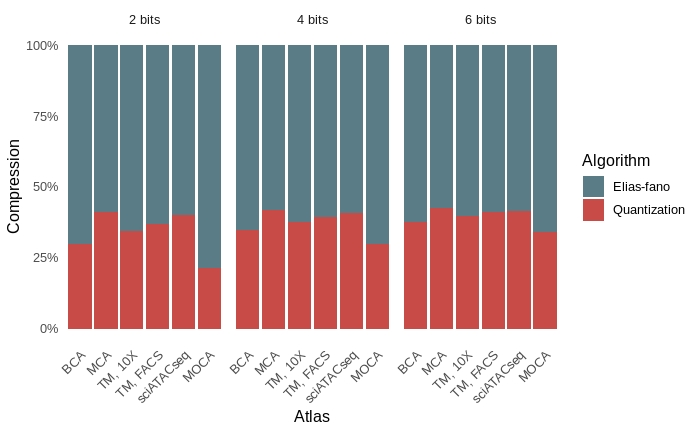

## scfind paper figures

This repository contains scripts to recreate the figures from the [scfind paper](https://doi.org/10.1101/788596).

### Required R libraries

[scfind](https://github.com/hemberg-lab/scfind)
[SingleCellExperiment](https://bioconductor.org/packages/release/bioc/html/SingleCellExperiment.html)
[RcolorBrewer](https://cran.r-project.org/web/packages/RColorBrewer/index.html)
[ggplot2](https://cran.r-project.org/web/packages/ggplot2/index.html)
[ggpubr](https://cran.r-project.org/web/packages/ggpubr/index.html)
[ggrepel](https://cran.r-project.org/web/packages/ggrepel/index.html)
[ComplexHeatmap](https://github.com/jokergoo/ComplexHeatmap)
[UpSetR](https://cran.r-project.org/web/packages/UpSetR/index.html)
[scales](https://cran.r-project.org/web/packages/scales/index.html)
[cowplot](https://cran.r-project.org/web/packages/cowplot/index.html)

### Fig. 1
[script](1cdef.Rmd)  
[keynote](keynote/1.key)  
[pdf](keynote/1.pdf)  
[jpg](keynote/1.jpeg)  

### Fig. 2
[script](2abcdef.Rmd)  
[keynote](keynote/2.key)  
[pdf](keynote/2.pdf)  
[jpg](keynote/2.jpeg)  

### Fig. 3
[script](3abc.Rmd)  
[keynote](keynote/3.key)  
[pdf](keynote/3.pdf)  
[jpg](keynote/3.jpeg)  

### Fig. 4
[script](4b.Rmd)  
[keynote](keynote/4.key)  
[pdf](keynote/4.pdf)  
[jpg](keynote/4.jpeg)  

### Fig. 5
[script](5abcd.Rmd)  
[keynote](keynote/5.key)  
[pdf](keynote/5.pdf)  
[jpg](keynote/5.jpeg)  

### Table 1
[pdf](pdf/Table1.pdf)  
[jpeg](jpeg/Table1.jpeg)  

### Fig. S1
[jpeg](jpeg/S1.jpeg)  

### Fig. S2
[jpeg](jpeg/S2.jpeg)  

### Fig. S3
[jpeg](jpeg/S3.jpeg)  

### Fig. S4
[jpeg](jpeg/S4.jpeg)  

### Fig. S5
[jpeg](jpeg/S5.jpeg)  

### Fig. S6
[jpeg](jpeg/S6.jpeg)  

### Fig. S7
[jpeg](jpeg/S7.jpeg)  

### Fig. S8
[jpeg](jpeg/S8.jpeg)  

### Fig. S9
[jpeg](jpeg/S9.jpeg)  

### Fig. S10
[jpeg](jpeg/S10.jpeg)  

### Fig. S13
[jpeg](jpeg/S13.jpeg)  

### Fig. S14
[jpeg](jpeg/S14.jpeg)  

### Fig. S15
[jpeg](jpeg/S15.jpeg)  

### Fig. S16
[jpeg](jpeg/S16.jpeg)  

### Fig. S17
[jpeg](jpeg/S17.jpeg)  

### Fig. S18
[jpeg](jpeg/S18.jpeg)  

### Table S1
[data_compression](data/S1.tsv)

### Table S2
[data_compression](data/S2.tsv)

### Table S3
[data_compression](data/S3.tsv)

### Table S4
[data_compression](data/S4.tsv)

### Table S5
[data_compression](data/S5.tsv)

### Table S6
[data_compression](data/S6.xlsx)

### Table S7
[data_compression](data/S7.xlsx)

### Table S8
[data_compression](data/S8.xlsx)

### Table S9
[data_compression](data/S9.xlsx)

### Table S10
[data_compression](data/S10.tsv)

### Table S11
[data_compression](data/S11.tsv)

### Table S12
[data_compression](data/S12.tsv)